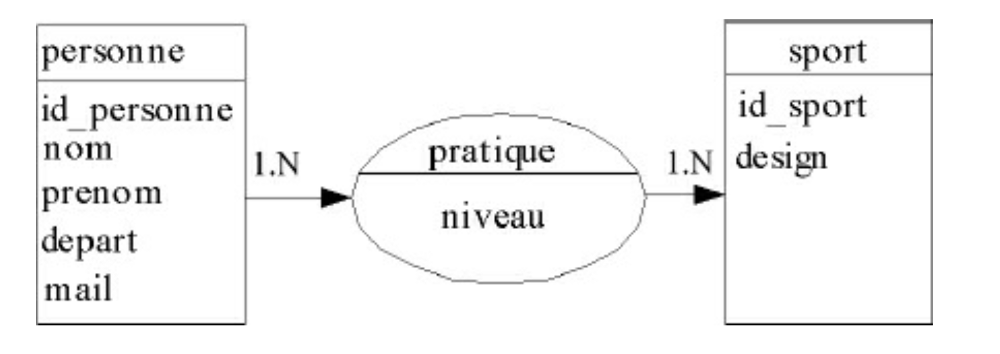
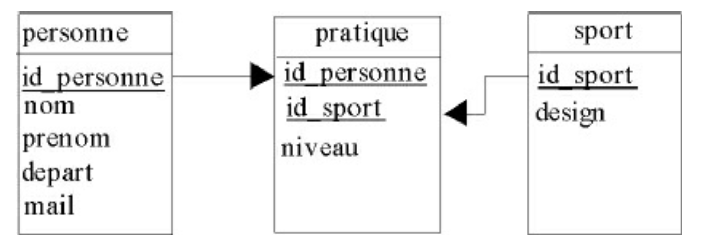

# Site de rencontres:
CDC :

- Le site offre aux internautes sportifs la possibilité d’entrer en contact avec d’autres personnes pratiquants ou supporters d’un même sport dans un département donné.
- Le site est réalisé avec PHP et une base SQLite (idéalement MySQL).
- Chaque page affiche un en-tête commun.
- Pour avoir accès aux informations du site, chaque visiteur s’enregistre au préalable en tant que pratiquant ou supporter d’au moins un sport.
- L’identification se fait par le biais de l’e-mail du visiteur. Une fois identifié, le visiteur a accès à une page de recherche affichant les coordonnées des personnes qui répondent aux critères qu’il a définis. L’autorisation d’accès et l’e-mail sont stockés dans un cookie.
- Un visiteur non enregistré souhaitant accéder à la page de recherche est redirigé automatiquement vers la page d’inscription.
- Si un visiteur déjà identifié veut s’inscrire pour un autre sport que celui de sa première inscription, le formulaire affiche ses coordonnées automatiquement dans le formulaire afin de lui faciliter la saisie.

# L'interface 

L’interface comprend trois pages, la page d’accueil, la page d’inscription et la page de recherche, chacune dotée de fonctionnalités spécifiques.

- Page d'accueil

    Nommée `index.php`, la page d’accueil contient les éléments suivants :
    - En-tête commun.
    - Liste des sports existants dans la base.
    - Zone de saisie de l’e-mail pour identifier le visiteur. 
    Si l’e-mail figure déjà dans la base, un message de bienvenue s’affiche avec le nom du visiteur, 
    et les données personnelles du visiteur sont enregistrées dans un cookie. Deux nouveaux liens sont
    créés dynamiquement, un vers la page de recherche et un vers la page d’inscription, permettant de s’enregistrer pour un nouveau sport. 
    Si l’e-mail ne figure pas dans la base, le visiteur est redirigé automatiquement vers la page d’inscription.
    - Lien vers la page d’inscription pour les personnes non encore enregistrées.
    
- Page d'inscription

    Nommée `ajout.php`, la page d’inscription contient les éléments suivants :
    
    - En-tête commun.
    - Formulaire HTML d’enregistrement comprenant trois zones principales :
        – La première comporte les zones de saisie de texte pour le nom, le prénom, le département et l’e-mail.
        – La deuxième contient une zone de sélection proposant le choix des sports existant dans la table sport. 
        Cette liste est construite dynamiquement à partir des sélections des sports existants dans la base par les utilisateurs. 
        Une seconde liste de sélection permet à l’utilisateur de choisir son niveau. 
        Les choix possibles sont « débutant », « confirmé », « pro » ou « supporter ». Une zone de saisie de texte et un bouton d’envoi particulier permettent au visiteur d’ajouter un nouveau sport dans la table s’il n’est pas proposé dans la liste. Après l’enregistrement du nouveau sport, le visiteur est dirigé vers la page d’inscription mise à jour avec ce nouveau sport.
        – Le formulaire se termine par les habituels boutons d’envoi et de réinitialisation.
    - Lien vers la page d’accueil.
    - Script vérifiant l’existence de saisies dans les zones de texte et les listes de sélection, enregistrant les données dans la base sportifs et affichant l’identifiant généré.

- La page de recherche

    Nommée `recherche.php`, la page de recherche contient les éléments suivants :
    - En-tête commun.
    - Formulaire de saisie contenant trois listes de sélection : 
        – La première contient la liste des sports existants. Elle est construite dynamiquement à partir des données de la table `sport`, comme dans la page d’inscription.
        – La deuxième indique le niveau des pratiquants et comporte les mêmes valeurs que dans le formulaire d’inscription.
        – La troisième contient la liste des départements dans lesquels il existe des personnes inscrites. Elle est construite dynamiquement à partir des données de la
        `table` personne.
        - Lien vers la page d’accueil.
        - Lien vers la page d’inscription.
        - Script traitant les informations saisies et affichant la liste des partenaires correspondants dans un tableau HTML. 
        Les données saisies sont réaffichées dans le formulaire afin de faciliter une éventuelle nouvelle recherche de l’utilisateur.
        
- La base de données :

- Les entités en présence sont une `personne` et un `sport`.
- Une personne peut pratiquer un ou plusieurs sports. La cardinalité du coté de l’entité
`personne` est donc 1.N.
- Un sport peut être pratiqué par une ou plusieurs personnes. La cardinalité du coté de
l’entité sport est donc également 1.N.
- Ces entités sont reliées par l’association `pratique`, qui possède l’attribut `niveau`.

LE MCD

LE MLD

---

Vous êtes libre de mettre la mise en page que vous voulez.

 
* Vous allez devoir faire un fork  de ce projet ( car il doit rester sous cette forme merci d'avance)
* Vous devrer en faire toutes les modifications nécessaire au bon fonctionnement du site.
* > Bon chance !!
